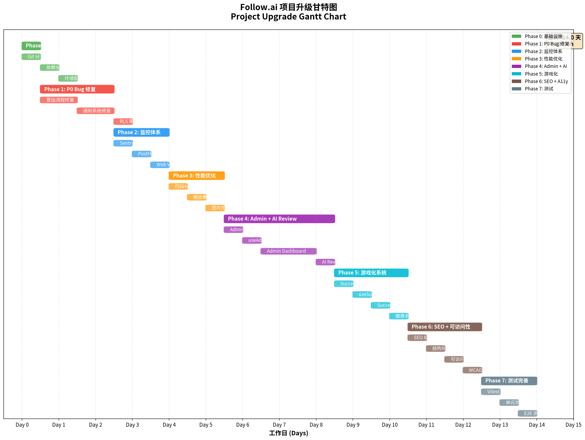

# Follow.ai 项目升级计划

> **版本**: 1.0  
> **日期**: 2026年1月8日  
> **作者**: Manus AI

---

## 项目概述

本文档包含 Follow.ai 项目升级的完整项目计划，包括甘特图、时间线和工作量分布。

---

## 甘特图

---

## 项目时间线

---

## 工作量分布

---

## 项目阶段详情

### 总体规划

| 指标 | 数值 |
|------|------|
| **总工期** | 14 天 |
| **总工时** | 112 小时 |
| **阶段数** | 8 个 |
| **任务数** | 26 个 |

---

### Phase 0: 基础设施准备

| 属性 | 值 |
|------|-----|
| **工期** | 0.5 天 (4 小时) |
| **占比** | 3.6% |
| **前置条件** | 无 |
| **产出物** | 配置好的开发环境 |

**任务清单**:

| # | 任务 | 工时 | 负责人 |
|---|------|------|--------|
| 0.1 | Git 分支策略 | 1h | 开发者 |
| 0.2 | 依赖安装 | 2h | 开发者 |
| 0.3 | 环境配置 | 1h | 开发者 |

**验收标准**:
- [ ] `feature/ultimate-upgrade` 分支已创建
- [ ] 所有监控依赖已安装
- [ ] 环境变量模板已更新

---

### Phase 1: P0 Bug 修复

| 属性 | 值 |
|------|-----|
| **工期** | 2 天 (16 小时) |
| **占比** | 14.3% |
| **前置条件** | Phase 0 完成 |
| **产出物** | 修复后的登出流程、通知系统 |

**任务清单**:

| # | 任务 | 工时 | 负责人 |
|---|------|------|--------|
| 1.1 | 登出流程修复 | 6h | 开发者 |
| 1.2 | 通知系统修复 | 8h | 开发者 |
| 1.3 | RLS 策略启用 | 2h | 开发者 |

**验收标准**:
- [ ] 登出后 localStorage 已清理
- [ ] 通知从数据库加载
- [ ] notifications 表 RLS 已启用

---

### Phase 2: 监控体系

| 属性 | 值 |
|------|-----|
| **工期** | 1.5 天 (12 小时) |
| **占比** | 10.7% |
| **前置条件** | Phase 0 完成 |
| **产出物** | Sentry、PostHog、Web Vitals 集成 |

**任务清单**:

| # | 任务 | 工时 | 负责人 |
|---|------|------|--------|
| 2.1 | Sentry 集成 | 4h | 开发者 |
| 2.2 | PostHog 集成 | 4h | 开发者 |
| 2.3 | Web Vitals 监控 | 4h | 开发者 |

**验收标准**:
- [ ] Sentry 捕获错误
- [ ] PostHog 追踪事件
- [ ] Web Vitals 日志显示

---

### Phase 3: 性能优化

| 属性 | 值 |
|------|-----|
| **工期** | 1.5 天 (12 小时) |
| **占比** | 10.7% |
| **前置条件** | Phase 0 完成 |
| **产出物** | 代码分割、懒加载、图片优化 |

**任务清单**:

| # | 任务 | 工时 | 负责人 |
|---|------|------|--------|
| 3.1 | 代码分割配置 | 4h | 开发者 |
| 3.2 | 路由懒加载 | 4h | 开发者 |
| 3.3 | 图片优化 | 4h | 开发者 |

**验收标准**:
- [ ] 构建生成多个 chunk 文件
- [ ] 主 chunk < 200KB
- [ ] 首屏加载 < 2s

---

### Phase 4: Admin Dashboard + AI Review

| 属性 | 值 |
|------|-----|
| **工期** | 3 天 (24 小时) |
| **占比** | 21.4% |
| **前置条件** | Phase 1 完成 |
| **产出物** | Admin Dashboard、AI Review 功能 |

**任务清单**:

| # | 任务 | 工时 | 负责人 |
|---|------|------|--------|
| 4.1 | Admin 数据库准备 | 4h | 开发者 |
| 4.2 | useAdmin Hook | 4h | 开发者 |
| 4.3 | Admin Dashboard 页面 | 12h | 开发者 |
| 4.4 | AI Review Edge Function | 4h | 开发者 |

**验收标准**:
- [ ] Admin 可访问管理面板
- [ ] AI Review 返回评分
- [ ] 审计日志记录操作

---

### Phase 5: 游戏化系统增强

| 属性 | 值 |
|------|-----|
| **工期** | 2 天 (16 小时) |
| **占比** | 14.3% |
| **前置条件** | Phase 1 完成 |
| **产出物** | Success Score、徽章系统 |

**任务清单**:

| # | 任务 | 工时 | 负责人 |
|---|------|------|--------|
| 5.1 | Success Score SQL | 4h | 开发者 |
| 5.2 | useSuccessScore Hook | 4h | 开发者 |
| 5.3 | SuccessScoreCard 组件 | 4h | 开发者 |
| 5.4 | 徽章系统 | 4h | 开发者 |

**验收标准**:
- [ ] Success Score 正确计算
- [ ] 徽章正确显示
- [ ] 等级提升触发

---

### Phase 6: SEO + 可访问性

| 属性 | 值 |
|------|-----|
| **工期** | 2 天 (16 小时) |
| **占比** | 14.3% |
| **前置条件** | 无 |
| **产出物** | SEO 组件、可访问性工具库 |

**任务清单**:

| # | 任务 | 工时 | 负责人 |
|---|------|------|--------|
| 6.1 | SEO 组件 | 4h | 开发者 |
| 6.2 | 结构化数据 | 4h | 开发者 |
| 6.3 | 可访问性工具库 | 4h | 开发者 |
| 6.4 | WCAG 2.2 合规 | 4h | 开发者 |

**验收标准**:
- [ ] 结构化数据验证通过
- [ ] 键盘导航正常
- [ ] 对比度符合 WCAG

---

### Phase 7: 测试完善

| 属性 | 值 |
|------|-----|
| **工期** | 1.5 天 (12 小时) |
| **占比** | 10.7% |
| **前置条件** | Phase 0 完成 |
| **产出物** | Vitest 配置、单元测试、E2E 测试修复 |

**任务清单**:

| # | 任务 | 工时 | 负责人 |
|---|------|------|--------|
| 7.1 | Vitest 配置 | 4h | 开发者 |
| 7.2 | 单元测试编写 | 4h | 开发者 |
| 7.3 | E2E 测试修复 | 4h | 开发者 |

**验收标准**:
- [ ] 单元测试覆盖率 > 70%
- [ ] E2E 测试通过率 > 90%
- [ ] CI/CD 集成完成

---

## 里程碑

| 里程碑 | 完成日期 | 标志 |
|--------|----------|------|
| **M1: P0 Bug 修复完成** | Day 2.5 | 登出和通知系统正常 |
| **M2: 性能优化完成** | Day 5.5 | 首屏加载 < 2s |
| **M3: 游戏化完成** | Day 10.5 | Success Score 上线 |
| **M4: 项目完成** | Day 14 | 所有测试通过 |

---

## 风险管理

| 风险 | 概率 | 影响 | 缓解措施 |
|------|------|------|----------|
| Sentry/PostHog 配置复杂 | 中 | 低 | 使用官方文档和示例 |
| AI Review API 限制 | 低 | 中 | 实现重试机制和降级 |
| RLS 策略影响性能 | 低 | 中 | 添加适当索引 |
| E2E 测试不稳定 | 高 | 中 | 增加等待时间和重试 |

---

## 资源需求

| 资源 | 数量 | 备注 |
|------|------|------|
| 开发者 | 1 | 全栈开发 |
| Sentry 账户 | 1 | 免费计划足够 |
| PostHog 账户 | 1 | 免费计划足够 |
| OpenAI API | 1 | 用于 AI Review |

---

## 附录

### 文件清单

| 文件 | 描述 |
|------|------|
| `DETAILED-IMPLEMENTATION-GUIDE.md` | 详细代码实现步骤 |
| `COMPREHENSIVE-TEST-PLAN.md` | 完整测试计划 |
| `gantt_chart.png` | 甘特图 |
| `timeline_chart.png` | 时间线图 |
| `workload_chart.png` | 工作量分布图 |

---

**文档版本**: 1.0  
**最后更新**: 2026年1月8日  
**作者**: Manus AI
